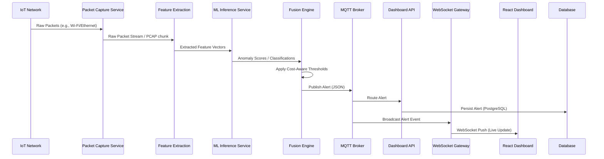

# Master Architecture Specification: Edge-AI IoT Intrusion Detection System (IDS)

This document serves as the COMPLETE FOUNDATIONAL FRAMEWORK and MASTER ARCHITECTURE SPECIFICATION for a lightweight, edge-AI network-centric IoT Intrusion Detection System (IDS) running on Raspberry Pi.

This system is designed for:
* Real-time IoT traffic monitoring
* Lightweight ML-based intrusion detection
* Device anomaly monitoring
* MQTT-based event broadcasting
* Dashboard visualization
* Edge deployment on Raspberry Pi

## Table of Contents
1. Complete Monorepo Structure
2. System Architecture
3. Core Microservices
4. Database Design
5. Event-Driven Pipeline
6. API Design
7. Configuration System
8. Security Architecture
9. Observability
10. Docker + Deployment
11. Coding Standards
12. Shared SDK / Common Library
13. ML Plugin Interface
14. Real-Time Dashboard Architecture
15. Implementation Roadmap

---

## 1. COMPLETE MONOREPO STRUCTURE

The project follows a standard monorepo architecture, separating applications (`apps/`), shared packages (`packages/`), infrastructure configurations (`infra/`), and deployment scripts.

```text
ids-monorepo/
├── apps/                               # Independent deployable services
│   ├── backend/                        # Cloud/Server backend services
│   │   ├── dashboard-api/              # FastAPI: Serves REST endpoints for the React dashboard
│   │   ├── websocket-gateway/          # FastAPI: Manages live WebSocket connections to the UI
│   │   └── auth-service/               # FastAPI: Manages users, JWTs, and RBAC
│   ├── edge/                           # Services deployed to the Raspberry Pi edge nodes
│   │   ├── packet-capture-service/     # Python/Scapy: Raw packet ingestion and pcap generation
│   │   ├── feature-extraction-service/ # Python: Converts pcaps/flows into ML feature vectors
│   │   ├── device-monitor-service/     # Python: Tracks device presence, ARP, and MAC anomalies
│   │   ├── ml-inference-service/       # Python/ONNX: Runs lightweight ML detection models
│   │   ├── fusion-engine-service/      # Python: Aggregates alerts (cost-aware fusion detection)
│   │   └── mqtt-alert-service/         # Python: Publishes confirmed alerts to the MQTT broker
│   └── frontend/                       # User interfaces
│       └── dashboard-ui/               # React/TypeScript: Admin dashboard and threat map
├── packages/                           # Shared internal libraries and SDKs
│   ├── ids-core/                       # Core utilities, base classes, and generic helpers
│   ├── ids-schemas/                    # Pydantic schemas shared across all microservices
│   ├── ids-models/                     # SQLAlchemy database models and migrations (Alembic)
│   ├── ids-mqtt/                       # Shared MQTT client wrappers and topic definitions
│   └── ids-ml-plugins/                 # Abstract Base Classes (ABCs) for ML plugins and parsers
├── infra/                              # Infrastructure as Code and configurations
│   ├── docker/                         # Dockerfiles and Compose configurations
│   │   ├── edge/                       # docker-compose.edge.yml (Raspberry Pi target)
│   │   └── cloud/                      # docker-compose.cloud.yml (Backend services target)
│   ├── k3s/                            # Kubernetes manifests for advanced deployments
│   ├── mosquitto/                      # MQTT broker configurations, TLS certs, and ACLs
│   └── grafana/                        # Grafana dashboards and Prometheus configuration
├── scripts/                            # CI/CD, setup, and developer utility scripts
│   ├── setup_edge.sh                   # Script to bootstrap Raspberry Pi dependencies
│   ├── run_benchmarks.py               # Evaluates ML inference latency and memory
│   └── generate_certs.sh               # Generates self-signed TLS certs for local dev
├── tests/                              # Global integration and end-to-end tests
│   ├── e2e/                            # End-to-end flow tests (packet -> alert -> UI)
│   └── load/                           # Locust scripts for testing MQTT/API load
├── docs/                               # Additional developer documentation and ADRs
├── .github/                            # GitHub Actions workflows for CI/CD
│   └── workflows/
│       ├── test.yml                    # Runs pytest on all apps/packages
│       ├── lint.yml                    # Runs black, ruff, mypy
│       └── build.yml                   # Builds and pushes multi-arch Docker images
├── pyproject.toml                      # Global Python dependencies (Poetry/UV)
├── .pre-commit-config.yaml             # Pre-commit hooks configuration
└── README.md                           # Developer onboarding guide
```

---

## 2. SYSTEM ARCHITECTURE

The architecture is divided into the **Edge Node (Raspberry Pi)** and the **Cloud/Server Backend**. They communicate asynchronously via an MQTT Broker.

### Edge Architecture Flow
1. **Packet Capture** sniffs raw network traffic from the IoT network interface.
2. **Feature Extraction** converts raw packets into structured flow features.
3. **ML Inference** consumes features and runs lightweight models (e.g., Random Forest, Autoencoders).
4. **Device Monitor** tracks MAC/IP pairings and device states.
5. **Fusion Engine** aggregates model outputs and device anomalies, applying threshold logic to determine if an alert is warranted.
6. **MQTT Alert Service** formats the final alert and publishes it to the secure MQTT broker.

### Cloud/Backend Architecture Flow
1. **MQTT Broker (Mosquitto)** receives alerts from edge nodes.
2. **Dashboard API** subscribes to MQTT (or reads from DB) to persist alerts into PostgreSQL.
3. **WebSocket Gateway** listens for new alerts and streams them directly to the React Frontend.
4. **React Dashboard** displays live alerts, threat maps, and device analytics.

### Sequence Diagram: Anomaly Detection Flow


---

## 3. CORE MICROSERVICES

### 3.1 Edge Services (Raspberry Pi)

#### packet-capture-service
* **Responsibility**: Ingest raw network traffic using Scapy/tshark.
* **Inputs**: Network Interface (eth0, wlan0).
* **Outputs**: Raw packet chunks, filtered PCAP files.
* **Queues**: Internal Redis queue or ZeroMQ `raw_packets`.
* **Failure Handling**: Auto-restarts via Docker. Drops packets if queue is full to prevent memory OOM.
* **Scaling**: Typically 1 instance per network interface.

#### feature-extraction-service
* **Responsibility**: Parse packets into flow records (e.g., CICIDS2017 format), calculate statistics (packet length, inter-arrival time).
* **Inputs**: `raw_packets` queue.
* **Outputs**: Feature vectors (JSON/Numpy arrays).
* **Queues**: Internal queue `feature_vectors`.
* **Failure Handling**: Skips malformed packets, logs errors.

#### device-monitor-service
* **Responsibility**: Track IoT device presence, detect ARP spoofing, monitor MAC-IP bindings.
* **Inputs**: `raw_packets` (filtered for ARP/DHCP).
* **Outputs**: Device state changes, spoofing alerts.
* **Queues**: Internal queue `device_events`.

#### ml-inference-service
* **Responsibility**: Run lightweight ONNX/TFLite models against feature vectors.
* **Inputs**: `feature_vectors` queue.
* **Outputs**: Prediction probabilities, anomaly scores.
* **Queues**: Internal queue `ml_predictions`.
* **Failure Handling**: Fallback to rule-based detection if model crashes.

#### fusion-engine-service
* **Responsibility**: Correlate ML predictions and device events. Apply cost-aware logic to reduce false positives.
* **Inputs**: `ml_predictions`, `device_events`.
* **Outputs**: Confirmed Threat Alerts.
* **Queues**: Internal queue `confirmed_alerts`.

#### mqtt-alert-service
* **Responsibility**: Bridge internal edge events to the global MQTT broker.
* **Inputs**: `confirmed_alerts`.
* **Outputs**: MQTT topics (e.g., `edge/alerts`).
* **Failure Handling**: Local SQLite buffering if MQTT broker is offline. QoS 1 for guaranteed delivery.

### 3.2 Cloud/Backend Services

#### dashboard-api
* **Responsibility**: REST API for historical data, CRUD for devices/models.
* **APIs**: FastAPI endpoints `/api/v1/alerts`, `/api/v1/devices`.
* **Inputs**: HTTP REST, DB.
* **Outputs**: JSON HTTP Responses.

#### websocket-gateway
* **Responsibility**: Maintain persistent WebSocket connections to frontends.
* **Inputs**: Redis Pub/Sub or MQTT wildcard subscriptions.
* **Outputs**: WebSocket frames to React UI.
* **Scaling**: Horizontally scalable using Redis as a backplane.

#### auth-service
* **Responsibility**: User registration, login, JWT generation, RBAC enforcement.
* **APIs**: `/auth/login`, `/auth/refresh`.
* **Outputs**: JWT tokens.

#### logging-service & metrics-service
* **Responsibility**: Centralized collection of logs (Elasticsearch/Loki) and metrics (Prometheus exporter).
* **Inputs**: Docker logs, statsd.

#### config-service
* **Responsibility**: Serve dynamic configuration (thresholds, active models) to edge nodes.
* **APIs**: `/api/v1/config/edge`.

---

## 4. DATABASE DESIGN

The primary backend database is **PostgreSQL**. Edge nodes use **SQLite** for local buffering.
ORM: **SQLAlchemy 2.0**.

### 4.1 SQLAlchemy Models (Example)

```python
from datetime import datetime
from sqlalchemy import Column, Integer, String, Float, Boolean, DateTime, ForeignKey, JSON
from sqlalchemy.orm import declarative_base, relationship

Base = declarative_base()

class Device(Base):
    __tablename__ = 'devices'
    id = Column(String, primary_key=True)  # MAC Address
    ip_address = Column(String, index=True)
    hostname = Column(String)
    device_type = Column(String)
    is_trusted = Column(Boolean, default=False)
    first_seen = Column(DateTime, default=datetime.utcnow)
    last_seen = Column(DateTime, default=datetime.utcnow, onupdate=datetime.utcnow)

class Alert(Base):
    __tablename__ = 'alerts'
    id = Column(Integer, primary_key=True, autoincrement=True)
    edge_node_id = Column(String, index=True)
    device_id = Column(String, ForeignKey('devices.id'), index=True)
    alert_type = Column(String, index=True)  # e.g., 'DDoS', 'ARP_Spoof'
    severity = Column(String) # 'LOW', 'MEDIUM', 'HIGH', 'CRITICAL'
    confidence = Column(Float)
    payload = Column(JSON) # Full feature vector and ML metadata
    timestamp = Column(DateTime, default=datetime.utcnow, index=True)
    resolved = Column(Boolean, default=False)

    device = relationship("Device")
```

### 4.2 Indexing & Retention Strategy
* **Indexes**: B-Tree indexes on `timestamp`, `device_id`, and `alert_type` for fast dashboard filtering.
* **Retention**: Time-scale DB extension (or cron job) to partition the `alerts` table monthly and aggregate old data into a `packet_summaries` table to save space.

---

## 5. EVENT-DRIVEN PIPELINE

### 5.1 MQTT Topic Hierarchy
All cross-network communication happens over MQTT.

* `ids/edge/<node_id>/alerts` - Edge publishing confirmed threats (QoS 1).
* `ids/edge/<node_id>/status` - Edge publishing heartbeat and metrics (QoS 0).
* `ids/cloud/config/update` - Cloud publishing threshold/model updates to all edges (QoS 1).
* `ids/cloud/command/<node_id>` - Cloud sending targeted commands (e.g., restart, block IP) (QoS 2).

### 5.2 Event Payload Schema (JSON)

**Alert Schema Example:**
```json
{
  "event_id": "uuid-1234",
  "node_id": "pi-gateway-01",
  "timestamp": "2023-10-27T10:00:00Z",
  "device_mac": "00:1A:2B:3C:4D:5E",
  "alert": {
    "type": "Network_Anomaly",
    "category": "DDoS_Attempt",
    "severity": "HIGH",
    "confidence_score": 0.94
  },
  "ml_context": {
    "model_version": "rf_v2.1.onnx",
    "inference_time_ms": 12.5,
    "top_features": {"flow_duration": 1500, "pkt_count": 50000}
  }
}
```

### 5.3 Retry & QoS Strategy
* Alerts use **QoS 1** (At least once delivery) to ensure no missed threats.
* Heartbeats use **QoS 0** (At most once) to reduce overhead.
* If edge loses connection, `mqtt-alert-service` writes payloads to local SQLite buffer and flushes upon reconnection.


---

## 6. API DESIGN

The Backend Dashboard API provides endpoints for the UI and third-party integrations.

### 6.1 REST Endpoints (FastAPI)

* `GET /api/v1/alerts`
  * **Query Params**: `start_time`, `end_time`, `severity`, `device_id`
  * **Returns**: Paginated list of alerts.
* `GET /api/v1/devices`
  * **Returns**: List of all discovered devices and trust status.
* `PATCH /api/v1/devices/{id}/trust`
  * **Body**: `{"is_trusted": true}`
* `GET /api/v1/analytics/threat-map`
  * **Returns**: Aggregated threat data for visualizations.
* `POST /api/v1/models/upload`
  * **Body**: Multipart form (ONNX file). Updates the model registry.

### 6.2 WebSocket Events
* `ws://backend/ws/alerts`
  * **Server -> Client**: Pushes new alert JSON instantly.
  * **Client -> Server**: `{ "action": "subscribe", "filter": {"severity": "HIGH"} }`

---

## 7. CONFIGURATION SYSTEM

Configurations must be centralized but allow edge nodes to override locally if disconnected.

* **Format**: `.yaml` files combined with Environment Variables (`.env`). Pydantic `BaseSettings` handles validation.
* **Secret Management**: Passwords, API keys, and JWT secrets are strictly managed via environment variables (e.g., Docker Swarm secrets or simple `.env` injected by compose).

**Example `config.yaml` (Edge Node):**
```yaml
edge:
  node_id: ${NODE_ID:-pi-gateway-01}
  interface: eth0
ml:
  active_model: "models/rf_lightweight_v1.onnx"
  inference_batch_size: 32
fusion:
  alert_threshold: 0.85
  anomaly_cost_weight: 1.2
mqtt:
  broker_url: "ssl://mqtt.central-dashboard.internal:8883"
  ca_certs: "/etc/ssl/certs/ca-certificates.crt"
```

---

## 8. SECURITY ARCHITECTURE

1. **Authentication**: All APIs secured by JWT (JSON Web Tokens). Short expiration (15m) with refresh tokens.
2. **RBAC**: Roles defined as `ADMIN`, `ANALYST`, `READONLY`.
3. **MQTT Security**:
   * Mosquitto configured to reject anonymous connections.
   * Client Certificates (mTLS) for edge nodes communicating with the broker.
4. **Edge Hardening**:
   * Docker containers run as non-root users.
   * Packet capture container requires `CAP_NET_RAW` but drops all other capabilities.
5. **Model Security**:
   * Models are hashed (SHA256) before deployment. Edge validates hash before loading into memory.

---

## 9. OBSERVABILITY

* **Logging Standard**: JSON formatted logs pushed to stdout. `logging-service` (e.g., Promtail) scrapes Docker logs.
* **Metrics Collection**:
  * Prometheus Exporter runs on port `9090` of the edge nodes and backend APIs.
  * Captures: `packets_processed_total`, `ml_inference_duration_seconds`, `mqtt_publish_failures`.
* **Health Checks**: Every microservice implements a `GET /health` endpoint for Docker container health monitoring.
* **Grafana**: Pre-configured dashboards visualizing Prometheus metrics and PostgreSQL alert data.

---

## 10. DOCKER + DEPLOYMENT

### 10.1 Docker Compose Architecture

**Backend (`docker-compose.cloud.yml`)**:
* PostgreSQL Database
* Redis (WebSocket backplane & Celery queue)
* Mosquitto MQTT Broker
* Dashboard API
* WebSocket Gateway
* React UI (Nginx)

**Edge (`docker-compose.edge.yml`)**:
* Optimized for `linux/arm64`.
* Services share a Docker virtual network.
* Minimal base images (`python:3.11-slim`, `alpine`).

### 10.2 Deployment & Update Strategy
* Edge updates are managed via standard `docker compose pull && docker compose up -d`.
* Rollback strategy: Docker image tagging specifies exact versions (e.g., `ids-edge:1.2.0`). Previous image ID is cached on the Pi for fast rollback if health checks fail.


---

## 11. CODING STANDARDS

To maintain uniformity across 15 developer sessions:

1. **Python Formatting**: `black` with 88 line length.
2. **Linting**: `ruff` for fast, comprehensive linting.
3. **Type Hinting**: Strict type annotations enforced by `mypy`.
4. **DTOs**: Data Transfer Objects must be defined using Pydantic V2 in the `ids-schemas` package.
5. **Asynchronous Execution**: Backend and edge services must utilize `asyncio` for I/O bounds (e.g., MQTT publish, DB writes) to maximize throughput.
6. **API Versioning**: URL-based routing (e.g., `/api/v1/`).
7. **Testing**: `pytest` required for all packages. Minimum 80% test coverage threshold enforced via CI.

---

## 12. SHARED SDK / COMMON LIBRARY

To prevent duplication, developers must use the `packages/ids-core` and `packages/ids-schemas`.

**Key Components in SDK:**
* `MQTTClientWrapper`: Async wrapper over `paho-mqtt` standardizing connection logic, reconnects, and JSON serialization.
* `LoggerSetup`: Configures `logging` module to output standardized JSON formats.
* `ConfigLoader`: Validates env variables against Pydantic models.
* `PcapParser`: Shared utilities for stripping headers or normalizing IP payloads.

---

## 13. ML PLUGIN INTERFACE

To ensure the ML detection engine is hot-swappable and extensible, the system relies on an Abstract Base Class in `ids-ml-plugins`.

```python
from abc import ABC, abstractmethod
import numpy as np

class BaseAnomalyDetector(ABC):
    @abstractmethod
    def load_model(self, path: str) -> bool:
        # Loads ONNX/TFLite model into memory.
        pass

    @abstractmethod
    def predict(self, feature_vector: np.ndarray) -> dict:
        # Runs inference.
        # Returns: {'is_anomaly': bool, 'score': float, 'category': str}
        pass
```
* **Supported Backends**: Future implementations will include `ONNXDetector` and `TFLiteDetector`.

---

## 14. REAL-TIME DASHBOARD ARCHITECTURE

The Frontend is a React Single Page Application (SPA).

* **State Management**: `Zustand` for lightweight, hook-based state management (storing live alerts, device list).
* **Styling**: `TailwindCSS` for rapid UI layout.
* **Charts**: `Recharts` for plotting network traffic anomalies over time.
* **Live Updates**: A global `useWebSocket` hook connects to the `websocket-gateway` and updates the Zustand store automatically upon receiving a new alert payload.

---

## 15. IMPLEMENTATION ROADMAP

### PHASE 1: Foundation (Current phase)
* Monorepo setup, SDK definitions, Docker scaffolding.

### PHASE 2: Packet Capture & Edge Infrastructure
* Implement `packet-capture-service` and local device monitoring.

### PHASE 3: Feature Extraction
* Build the pipeline to convert raw PCAP data into CICIDS2017 style flow features.

### PHASE 4: ML Inference Engine
* Implement `ids-ml-plugins` ABCs, integrate ONNX runtime, create a baseline dummy model for testing.

### PHASE 5: Fusion Engine & MQTT
* Implement logic to combine ML outputs with device monitor state. Ensure resilient MQTT publishing.

### PHASE 6: Cloud Backend & Database
* SQLAlchemy models, FastAPI REST endpoints, PostgreSQL setup.

### PHASE 7: Dashboard UI
* React implementation, WebSocket integration, Threat Map visualization.

### PHASE 8: Optimization
* Profiling Raspberry Pi memory usage. Shrinking Docker images. Tuning `asyncio` loops.

### PHASE 9: Security Hardening
* Implement mTLS, JWT auth, and container capability dropping.

### PHASE 10: Research Benchmarking
* Final evaluation of latency, detection accuracy, and resource footprint under simulated IoT attack loads.

---

**END OF DOCUMENT**
